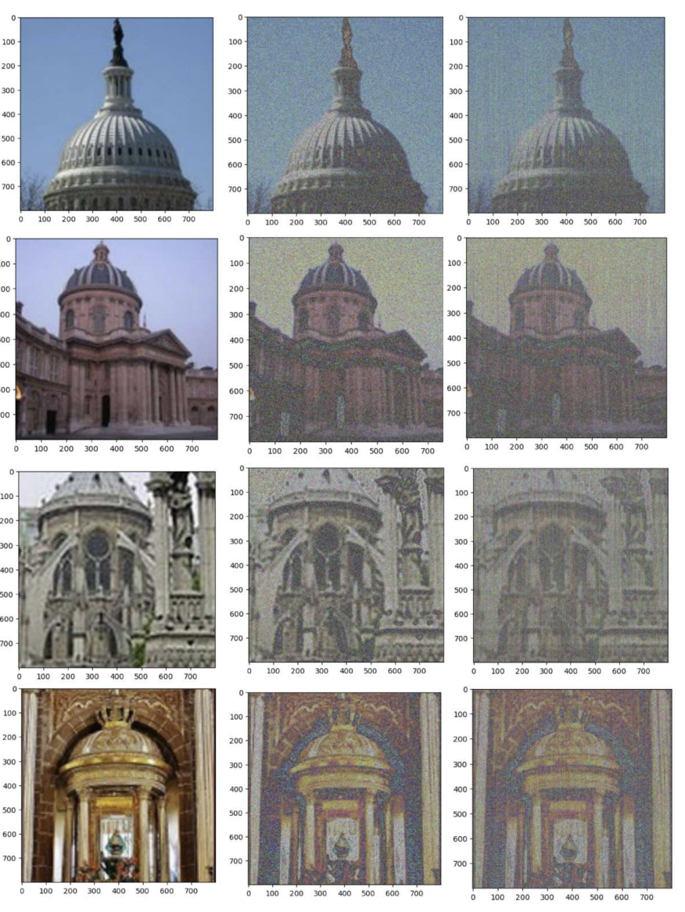

# Image-Denoising-with-Gaussian-Noise-and-SVD-Analysis
This project adds Gaussian noise to images and removes it using SVD to simulate real-world noise conditions and enhance image clarity through denoising.

This project implements an image denoising process through the following key steps:

1. **Image Input:**
   - The project starts by loading an image using OpenCV and resizing it to fit the necessary dimensions.

2. **Adding Gaussian Noise:**
   - A function adds Gaussian noise to the image. Gaussian noise is a type of random noise commonly found in real-world imaging systems. This noise is added to simulate real-world imperfections in captured images, such as those caused by camera sensors or transmission errors.
   - The project uses the **Box-Muller transform** to generate Gaussian-distributed random values and applies them to each pixel of the image.

3. **Denoising Process:**
   - After adding noise, the project attempts to remove it using a denoising algorithm. This involves applying **thresholding** to each pixel. If the pixel's intensity is below a specified threshold, it is set to black (0); otherwise, it is set to white (255). This simplifies the image and reduces noise.
   
4. **Singular Value Decomposition (SVD):**
   - The image matrix is decomposed using **SVD**, a matrix factorization technique that breaks the image into three matrices (U, S, V). 
   - The singular values in matrix S represent the important features of the image. By thresholding these singular values (setting small values to zero), the project effectively reduces noise while preserving significant image details.
   
5. **Reconstruction of Image:**
   - After applying SVD and reducing noise, the image is reconstructed by multiplying the U, modified S, and V matrices back together. This produces a denoised version of the original image.

6. **Final Output:**
   - The denoised image is then displayed and saved, showing an improved version with less noise while maintaining key visual details.

Through these steps, the project achieves noise reduction while preserving image integrity, using Gaussian noise generation, threshold-based denoising, and SVD for efficient matrix-based noise reduction.
